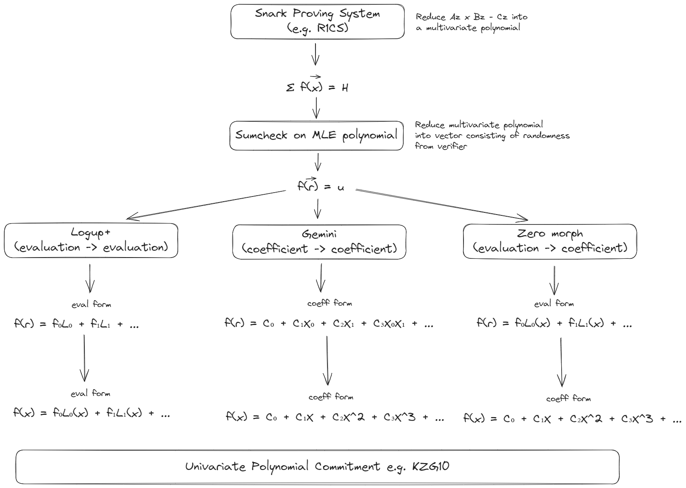

# Hello, Hypercube!

### Motivation

This is a project as part of ZK Hack Istanbul 2023. zk-SNARKS has always been a black box to most ZK developers, and our motivation is to deconstruct the black box into its base level primitives, showcasing the various techniques that can be used to transform a much complex constraints problem into simpler univariate polynomials that are much easier and efficient to dealt with.

The goal is to implement cryptographic primitives to reduce sumcheck-based zk-SNARKS proving system into a univariate polynomial eventually. We call it "Hello, Hypercube!" because a multilinear polynomial can be represented as points on a Boolean hypercube and reduced through evaluations on it partial sum (using sumcheck).

### Overview



The above diagram shows the outline of this project. Starting from the top level, we have a ZK proving system (a simplified version of Spartan is implemented here). The proving system can be represented as a multilinear polynomial. We can think of the multilinear polynomial as a Boolean hypercube. For example, if the polynomial is of form $`f(x_1, x_2, x_3)`$, then the hypercube is of dimension 3. We can think of f as following:
```
f(0, 0, 0) = v_0
f(0, 0, 1) = v_1
f(0, 1, 0) = v_2
f(0, 1, 1) = v_3
f(1, 0, 0) = v_4
f(1, 0, 1) = v_5
f(1, 1, 0) = v_6
f(1, 1, 1) = v_7
```
where $`v_i`$ is the value of the polynomial at the point $`(x_1, x_2, x_3)`$ = $`(i_1, i_2, i_3)`$. Point $`v_i`$ is each a vertex of the hypercube. We can then evaluate over the hypercube to get the partial sums from the sumcheck protocol. The purpose of evaluating the polynomial on a Boolean hypercube is that multilinear sumcheck is efficient for bitwise operations.

Thinking of zk-SNARKS construction as hypercubes is very intuitive. For example, R1CS follows the general form of $`A\vec{z}\circ B\vec{z} = C\vec{z}`$, which we can decompose it into multiple polynomials as shown in the diagram below. Each polynomial is a hypercube, and to evalutate their relationships we just need to evaluate by traversing the vertices of the hypercubes.


After the sumcheck protocol, we have reduced the polynomial to a simpler form where it is a polynomial dependent on the verifier's randomness during sumcheck. This is represented as f(r) and is still a multilinear polynomial, though a much smaller one. We want to further reduce this to a univariate polynomial. Three ways that have been mentioned in literature are [LogUp+](https://eprint.iacr.org/2023/1284.pdf), [Gemini](https://eprint.iacr.org/2022/420.pdf) and [ZeroMorph](https://eprint.iacr.org/2023/917.pdf). They each use different techniques, which are:
1. LogUp+: reduction of multivariate polynomial in evaluation form to univariate in evaluation form
2. Gemini: reduction of multivariate polynomial in coefficient form to univariate in coefficient form
3. ZeroMorph: reduction of multivariate polynomial in evaluation form to univariate in coefficient form

It's much easier to deal with univariate polynomial using commitment schemes such as KZG10. Especially when a degree-N polynomial has really large degrees (i.e. N), the evaluation proofs of such polynomials become prohibitively expensive, which motivates the entire project.

### Running the code

```
cd univarization
cargo test
```

### Code Organization

The main files showcasing our work are as follows (in the `univarization/src` folder):
- `mle.rs`: representing polynomials using multilinear extension (MLE)
- `unipoly.rs`: representing univariate polynomials
- `sumcheck.rs`: sumcheck protocol on multilinear polynomials
- `gemini.rs`: implementation of the Gemini univarization technique as mentioned above
- `ph.rs`: implementation of the LogUp+ technique as mentioned above
- `fftunipoly.rs`: FFT functions needed on polynomial commitments

### Future Work

ZeroMorph is not implemented yet due to time constraint. Some of the polynomial constructions are not fully optimized yet. We look to benchmark the three approaches in the future. Adding zero knowledge construction will also be an interesting direction.

### Credits

Our work is based on the following papers and libraries:
- [LogUp+](https://eprint.iacr.org/2023/1284.pdf)
- [Gemini](https://eprint.iacr.org/2022/420.pdf)
- [ZeroMorph](https://eprint.iacr.org/2023/917.pdf)
- [Arkworks](https://github.com/arkworks-rs)